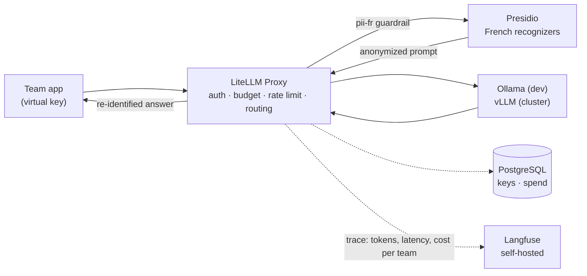

# llmops-gateway

[](https://github.com/Mak5ens/llmops-gateway/actions/workflows/ci.yml)
[](LICENSE)

**One gateway for every LLM call in the company: per-team keys and budgets, French PII anonymized before inference, every call traced and priced.**

> Status: under construction. Milestone 1.1 (local gateway) is done: LiteLLM, PostgreSQL and Ollama run with Docker Compose, behind usage aliases with a fallback, and three client teams have their own key, budget and rate limit. Milestone 1.2 (Presidio anonymization) is done: French personal data is masked before the model and put back into the answer, per team, with 99.2 % of it fully masked on a 100-text benchmark. See the [roadmap](#roadmap).

## Why

In the (fictional) 200-person company behind this project, every team calls LLMs its own way: shared API keys, no cost tracking, personal data sent in clear text.
The Platform team puts a **single gateway** in front of every model. Product teams become tenants: each one gets its own virtual key, budget and traces.

This repo is block 1 of an [internal AI platform portfolio](#part-of-an-internal-ai-platform). It runs with Docker Compose before any cluster exists, then moves to Kubernetes in [`llmops-platform`](https://github.com/Mak5ens/llmops-platform).

## How it works



1. A team calls one URL with its **virtual key**. LiteLLM checks the key, the budget and the rate limit, then routes by model and use case (`/chat`, `/embed`, `/ocr`), with fallback between models.
2. The **pii-fr guardrail** (LiteLLM's Presidio guardrail) replaces personal data (names, addresses, IBAN, French tax number, phone numbers) with numbered markers such as `<PERSON_1>`. The model only sees the anonymized prompt.
3. The answer is **re-identified** before it goes back to the caller.
4. Every call is traced in a **self-hosted Langfuse** with latency, tokens and cost per team. No trace leaves the company, and an automated test checks that traces contain no personal data.

## Stack

| Function | Tool |
| -- | -- |
| LLM gateway | [LiteLLM Proxy](https://docs.litellm.ai/docs/simple_proxy) |
| PII anonymization | [Microsoft Presidio](https://microsoft.github.io/presidio/) with French recognizers |
| Tracing and cost | [Langfuse](https://langfuse.com/) self-hosted (PostgreSQL, ClickHouse, Redis, SeaweedFS for S3) |
| Local models | [Ollama](https://ollama.com/) with a small open-source model; vLLM takes over on the cluster |
| Gateway database | PostgreSQL |

## Quick start

Requires Docker with Compose v2, [just](https://just.systems/), and [uv](https://docs.astral.sh/uv/) for the tests.

| Machine | Needed | Measured |
| -- | -- | -- |
| RAM given to Docker | 12 GB, 16 GB with the benchmark | 7.5 to 8.4 GiB at peak during `just test` over two runs, of which 2.6 GiB for Langfuse |
| Disk | 10 GB, 15 GB with the benchmark | 6.7 GB of images, 2 GB of models; the benchmark adds `qwen2.5:7b` (4.7 GB) |
| CPU | No GPU needed | The models run on the CPU; measured on an i7-14700KF (28 threads) |

Peak RAM per service, sampled with `docker stats` during the whole test suite: Presidio Analyzer 1.6 GiB (limited to 2 GiB), Langfuse web 1.4 GiB, the two Ollama servers 1.1 to 2.1 GiB each with their models loaded, Langfuse worker 0.8 GiB, LiteLLM 0.7 GiB, ClickHouse 0.4 GiB, the rest under 0.15 GiB each. On Windows, WSL 2 gives Docker half of the machine's RAM by default.

```bash
just gateway-up       # LiteLLM, PostgreSQL, two Ollama servers, Presidio, Langfuse, then the client teams; creates .env on first run
just test             # unit and integration tests: aliases, teams, limits, fallback, Presidio, PII masking, Langfuse
just gateway-down     # add --volumes to also delete the databases, the traces and the downloaded models
```

First start on a clean machine: about 2 minutes 10 seconds, including the download of three models (about 2 GB) and the build of the Presidio Analyzer image with its French model (2.8 GB on disk).
The gateway listens on `http://localhost:4000` and speaks the OpenAI API. Call it with a team key from `.env`, such as `TEAM_KEY_F1`:

```python
from openai import OpenAI

client = OpenAI(base_url="http://localhost:4000", api_key="sk-local-dev-team-f1")
client.chat.completions.create(model="chat-small", messages=[{"role": "user", "content": "Hello"}])
client.embeddings.create(model="embed", input="Le locataire a payé son loyer en retard.")
```

Langfuse's UI is on `http://localhost:3100`: sign in with `LANGFUSE_ADMIN_EMAIL` and `LANGFUSE_ADMIN_PASSWORD` from `.env`, or as a team lead (see [Tracing with Langfuse](#tracing-with-langfuse)). To contribute, install the git hooks (requires [pre-commit](https://pre-commit.com/)) with `just hooks`, and run `just lint`. Run `just` alone to list every recipe.

## Models and routing

Teams call **usage aliases**, never model names. The platform decides which model serves each alias in [`config/litellm.yaml`](config/litellm.yaml), so a model can be swapped without touching any client.

| Alias | Use | Model today | Server | Timeout |
| -- | -- | -- | -- | -- |
| `chat-small` | Short answers, classification, extraction | `qwen2.5:0.5b` | `ollama` | 30 s |
| `chat-large` | Better answers, slower | `qwen2.5:1.5b` | `ollama-large` | 20 s, then fallback to `chat-small` |
| `embed` | Embeddings, multilingual (French included), 768 dimensions | `granite-embedding:278m` | `ollama` | 30 s |

**Fallback.** If `chat-large` fails or times out, the gateway answers with `chat-small`. The response header `x-litellm-model-group` says which alias actually served the call, and the logs show `Falling back to model_group = chat-small`.
Measured with `just test -k fallback` on a laptop CPU:

| Situation | Time to answer through `chat-small` |
| -- | -- |
| Server dies while the gateway holds an open connection to it (worst case) | 21 s: the full `chat-large` timeout, then the fallback |
| Following calls during the outage | about 3 s: the connection fails at once |
| Server back | `chat-large` serves again on the next call |

`chat-large` has no retry (`num_retries: 0`): the fallback is its retry. With one retry, the worst case measured 44 s, since each attempt waits for the full timeout. The other aliases keep one retry.

### Swap or add a model

1. Add the model to `OLLAMA_MODELS` in `.env` (and in `.env.example` for everyone), then run `just gateway-up` to download it.
2. In `config/litellm.yaml`, point an alias to it, or add a new entry to `model_list` with a usage alias as `model_name`, the model as `ollama_chat/<name>` (or `ollama/<name>` for embeddings), the server as `api_base`, and a `timeout`.
3. Run `just gateway-reload`: Compose does not see changes to a mounted file, so LiteLLM must restart to read it.
4. Run `just smoke` (the alias tests), and add the new alias to `tests/integration/test_routing.py` if you created one.

Clients keep calling the same alias throughout.

## Teams, keys and budgets

Every client team has its own virtual key, the aliases it may call, a monthly budget and a rate limit, declared in [`config/tenants.yaml`](config/tenants.yaml).
The master key stays with the platform team: it creates teams and keys, and no application uses it.

| Team | Tenant | Aliases | Budget | Key limits | PII masking |
| -- | -- | -- | -- | -- | -- |
| `f1` | F1 strategy analyst (agent with RAG) | `chat-small`, `chat-large`, `embed` | $10 / 30 days | 60 requests and 100k tokens per minute | Optional |
| `mj` | Game master assistant | `chat-small`, `chat-large` | $5 / 30 days | 30 requests and 50k tokens per minute | Optional |
| `baux` | Lease compliance checker | `chat-large`, `embed` | $5 / 30 days | 20 requests and 50k tokens per minute | Required |

`just gateway-up` applies the file through [`scripts/bootstrap_tenants.py`](scripts/bootstrap_tenants.py), and `just tenants` applies it again after an edit, without restarting anything.
The script is idempotent: it creates what is missing, updates what exists, and never deletes a team.
Key values come from `.env` (`TEAM_KEY_F1`, `TEAM_KEY_MJ`, `TEAM_KEY_BAUX`); on the cluster they will come from a secret manager.

A team that steps out of its limits gets an explicit error, and only that team is blocked:

| Situation | Answer |
| -- | -- |
| Alias not allowed for the team | `401 team_model_access_denied`: *This team can only access models=['chat-small', 'chat-large']. Tried to access embed* |
| More requests or tokens per minute than the key allows | `429`: *Rate limit exceeded [...] Current limit: 2, Remaining: 0. Limit resets at: [time]* |
| Budget spent | `400 budget_exceeded`: *Budget has been exceeded! Team=[team] Current cost: [...], Max budget: [...]* |

`tests/integration/test_tenants.py` checks all three on a throwaway team, checks that `f1` still answers meanwhile, and checks that re-running the bootstrap left exactly one key per team.
The budget blocks the call right after the one that crossed it: LiteLLM counts spend in memory at once, and writes it to PostgreSQL in batches, so `/team/info` may show it a few seconds later.

**Why local models have a price.** LiteLLM knows no price for Ollama models, so spend stayed at $0 and budgets never triggered. Each alias carries an internal price per token instead (`chat-small` $0.10 / $0.40 per million tokens in / out, `chat-large` five times more, `embed` $0.02), a chargeback rate that works the same once a paid API joins. See [ADR-014](docs/adr/014-internal-price-for-self-hosted-models.md).

## Personal data anonymization (Presidio)

The gateway masks French personal data before the model sees it, and puts it back into the answer. On a `baux` request, as sent to Ollama (LiteLLM debug log):

| Step | Text |
| -- | -- |
| Caller sends | *Le bailleur est Jean Martin, domicilié au 12 rue de la Paix, 75002 Paris.* then *La locataire est Marie Dupont, IBAN FR76 3000 6000 0112 3456 7890 189. Jean Martin est-il joignable ?* |
| Model receives | *Le bailleur est `<PERSON_1>`, domicilié au `<FR_ADDRESS_2>`.* then *La locataire est `<PERSON_3>`, `<IBAN_CODE_4>`. `<PERSON_1>` est-il joignable ?* |
| Caller gets | The model's answer, with every marker replaced by its value |

### The pii-fr guardrail

The guardrail is LiteLLM's [Presidio integration](https://docs.litellm.ai/docs/proxy/guardrails/pii_masking_v2), set up in [`config/litellm.yaml`](config/litellm.yaml): French analysis, the entities to mask (names, places, addresses, emails, phones, IBAN, cards, crypto wallets, IP addresses, NIR, tax numbers) and a score threshold of 0.4. Dates stay in clear: a lease cannot be checked without them, and they identify nobody on their own.

**Two fixes to LiteLLM's markers.** LiteLLM 1.83.14 numbers markers in a way that breaks on real French text, as tested on this stack: overlapping detections (an address and the city inside it) were spliced into `FR_ADDRESS_2ON_4`, and two people in two messages both became `<PERSON_1>`, so the answer named the tenant as the landlord. Both bugs are open upstream ([#42130](https://github.com/BerriAI/litellm/issues/42130), [#31959](https://github.com/BerriAI/litellm/issues/31959)). [`guardrails/presidio_markers.py`](guardrails/presidio_markers.py) subclasses LiteLLM's guardrail and overrides only the method that builds the markers: overlapping detections are merged into one, and numbers run across the request. See [ADR-015](docs/adr/015-presidio-marker-fixes.md).

**Per team.** Assigning a guardrail to a team is a LiteLLM Enterprise feature, so the gateway uses what the open-source version offers: `pii-fr` runs on every request (`default_on`), and a team set to `pii_masking: optional` in `config/tenants.yaml` is opted out through its metadata, which only the admin API writes. A required team cannot opt out from the request: metadata sent by the caller is ignored.

An opted-out team masks one request by asking for `pii-fr-on-request`, a twin of `pii-fr` that runs only on demand (LiteLLM ignores a request for `pii-fr` itself once the team has opted out of it):

```python
client = OpenAI(base_url="http://localhost:4000", api_key="sk-local-dev-team-f1")
client.chat.completions.create(
    model="chat-small",
    messages=[{"role": "user", "content": "Je suis Marie Dupont, IBAN FR76 3000 6000 0112 3456 7890 189."}],
    # Not part of the OpenAI API, so the SDK sends it through extra_body; with curl, put it at the top of the JSON.
    extra_body={"guardrails": ["pii-fr-on-request"]},
)
```

The choice holds for that call only. A team that always wants masking switches to `pii_masking: required` and runs `just tenants`.

| Behaviour | Measured |
| -- | -- |
| Added latency with the guardrail (mock answer, no model call, p50 over 200 calls) | 11.5 ms instead of 4.5 ms: about 7 ms per request |
| Opted-out team | 4.5 ms, same as a gateway without any guardrail (4.4 ms): Presidio is not called |
| Presidio Analyzer down | Required team: `500 Presidio PII analysis failed` in 28 ms, nothing reaches the model. Opted-out teams keep working |
| Streaming | Works, but the answer is buffered: markers can be split across chunks, so LiteLLM waits for the whole answer, puts the values back, and sends it as one chunk |

**The model must copy markers as they are.** `qwen2.5:1.5b` sometimes drops the angle brackets (`PERSON_1`), and a marker that does not match exactly stays in the answer. A system message such as *Recopie les marqueurs entre chevrons tels quels* was enough in our tests; how often it happens without one is not measured yet.

### How well it works

[`benchmarks/results.md`](benchmarks/results.md) holds the full results of `just gateway-bench`, on 100 synthetic French texts (letters, emails, messages, forms) with 508 annotated personal data items, generated with a fixed seed by [`benchmarks/generate_dataset.py`](benchmarks/generate_dataset.py). Presidio runs as the guardrail does; the LLMs get the same entity types in a prompt and answer in JSON. Measured on an i7-14700KF, CPU only:

| Detector | Precision | Recall | Fully masked | Latency p50 per text | Internal price per 1,000 texts |
| -- | -- | -- | -- | -- | -- |
| Presidio (this gateway) | 88.1 % | 99.0 % | 99.2 % | 9 ms | no model call |
| qwen2.5:0.5b | 46.9 % | 9.1 % | 16.9 % | 538 ms | $0.08 |
| qwen2.5:1.5b | 77.2 % | 36.0 % | 40.2 % | 1.6 s | $0.40 |
| qwen2.5:7b | 91.1 % | 78.9 % | 82.7 % | 8.2 s | – |

*Fully masked* is the share of items with no character left in clear, whatever the type found: it is what keeps the data from the model.

**Does detecting personal data need a big model?** No. Presidio, with a spaCy model and rules, masks more than qwen2.5:7b (99.2 % against 82.7 %) about 900 times faster, and never invents or rewrites a value. Small LLMs are not an option at all: the 0.5b model masks 17 % of the items. Even the 7b model loses on structured identifiers, where rules and checksums are exact: it recopies IBANs without their spaces, so only 47 % of them could be found in the text, against 100 % for Presidio. Where it does well is names: 80 % recall with 99 % precision, against 99 % recall and 82 % precision for Presidio.

**Where Presidio leaks** (4 items out of 508, listed in the results): a first name too rare for the INSEE list (*Alexandrie*) and city names without context. The first run left 31 items in clear: names without context, which spaCy misses; addresses split over two lines; and Mastercard numbers of the 2xxx range, which Presidio's card recognizer does not know. `FrPersonRecognizer`, `CardRecognizer` and a fix to `FrAddressRecognizer` took fully masked items from 93.9 % to 99.2 %, and precision from 86.5 % to 88.1 %. On a held-out set generated with another seed, never used to tune the rules, the same changes took them from 94.1 % to 99.4 % (both sets come from the same templates: this checks new names and numbers, not new kinds of text).

The guardrail adds 10 ms per request (p50, 14.8 ms instead of 4.8 ms).

### Proof that nothing else leaks

`tests/integration/test_no_leak.py` replays the 100 texts through the gateway, with the key of a team under the guardrail, and searches every annotated value in two places:

- **What the model receives.** LiteLLM is restarted at `DEBUG` for this test only: that level logs the exact body sent to Ollama. Ollama itself never logs prompts, even with `OLLAMA_DEBUG=2`. The texts go through as real calls to `chat-small`, one token each.
- **Langfuse traces and container logs.** The traces are those of the replay, and the logs are those of LiteLLM and Ollama at their usual level, over the replay.

A value leaks as soon as one of its words gets through. Presidio masked *Alexandrie* as a city and left the surname: `<LOCATION_1> Toussaint`. Searching for the whole value missed that. Words the text also uses outside its personal data (`rue`, `de`, an amount) do not count.

| Where | Words found | Without the guardrail |
| -- | -- | -- |
| Body sent to the model | 3, the misses of the benchmark: *Toussaint*, *Paris*, *Caen* | 1,512 |
| Langfuse traces | 0 | 0 (messages are never traced) |
| LiteLLM and Ollama logs | 0 | 0 |

The three known misses are listed in the test: a new miss fails it, and so does one that gets fixed, so the list stays true. Each check was proven by breaking what it guards:

- turning the guardrail off (`default_on: false`) fails the check on the model;
- tracing the messages (`turn_off_message_logging: false`) fails the check on the traces;
- running LiteLLM at `DEBUG` in `compose.yaml` fails the check on the logs.

### Presidio services

[Presidio](https://microsoft.github.io/presidio/) runs as two services. The **Analyzer** finds personal data in a text and returns its type, position and score; the **Anonymizer** replaces those spans with placeholders.
Both can be called directly on `127.0.0.1`:

```bash
curl -s localhost:5002/analyze -H 'content-type: application/json' \
  -d '{"text": "Je suis Marie Dupont et j'"'"'habite à Lyon.", "language": "fr"}'
# PERSON "Marie Dupont" and LOCATION "Lyon", score 0.85 each
```

The official Analyzer image only ships an English spaCy model, which misses French names and places. [`docker/presidio-analyzer/Dockerfile`](docker/presidio-analyzer/Dockerfile) adds `fr_core_news_lg` 3.8.0, pinned by version and SHA-256.
The configuration is mounted from [`config/presidio/`](config/presidio/), so changing it needs `docker compose restart presidio-analyzer`, not a rebuild:

| File | Sets |
| -- | -- |
| `nlp.yaml` | One spaCy model per language (`fr`, `en`) and how their labels map to Presidio entities |
| `recognizers.yaml` | Which recognizers run, in which language, with which context words (table below) |
| `analyzer.yaml` | Supported languages and the default score threshold |

### French recognizers

Presidio knows no French identifier, and its phone recognizer does not look for French numbers.
The recognizers below live in [`docker/presidio-analyzer/pii_recognizers/`](docker/presidio-analyzer/pii_recognizers/) and are baked into the image; a server entry point imports them before Presidio reads `recognizers.yaml`.
A pattern alone is not enough when a check digit exists: a match whose key is wrong is dropped, so ordinary numbers do not come out as identifiers.

| Entity | Recognizer | Detection | False positives kept out by |
| -- | -- | -- | -- |
| `FR_NIR` | `FrNirRecognizer` | Social security number, with or without spaces, Corsica (2A, 2B) and overseas included | Structure (sex, month) and the key: 97 - (13 digits mod 97) |
| `FR_FISCAL_NUMBER` | `FrFiscalNumberRecognizer` | 13-digit tax number (SPI) | First digit 0 to 3, last 3 digits = first 10 mod 511 |
| `FR_ADDRESS` | `FrAddressRecognizer` | Number, street type (rue, avenue, bd...), capitalized name, then optional postcode and city, on the same line or the next | No checksum exists: street type and capital letters; score 0.6, raised by context |
| `PHONE_NUMBER` | `FrPhoneRecognizer` | Mobile and landline, spaces, dots or dashes, `+33`, `0033`, `(0)` | Validation by the [phonenumbers](https://github.com/daviddrysdale/python-phonenumbers) library, region FR |
| `PERSON` | `FrPersonRecognizer`, next to spaCy | Names after a title (*M.*, *Docteur*) or a form field (*Nom :*), alone on a line (letter header, signature), or starting with one of the 5,114 first names given to at least 500 children in France since 1900 ([INSEE](https://www.insee.fr/fr/statistiques/7633685)) | A first name alone scores 0.3, under the guardrail threshold, until a context word (*salut*, *mon fils*, *prénom*) raises it |
| `IBAN_CODE` | Presidio's `IbanRecognizer` | IBANs of every country, French context words added | Check digits (mod 97) |
| `CREDIT_CARD` | `CardRecognizer` | Presidio's card recognizer plus the Mastercard 2-series (2221 to 2720), which it misses | Luhn check digit |
| `URL` | `UrlOutsideEmailRecognizer` | Presidio's URL recognizer | No longer reports the domain of an email address |

Context words raise a score when they appear in the 5 words before a match: in a lease, *domiciliée 12 rue de la Paix, 75002 Paris* scores 0.95 instead of 0.6, and *joignable au 06 12 34 56 78* 0.75 instead of 0.4.
The spaCy model still makes mistakes of its own, measured in the [benchmark](#how-well-it-works): it misses city names without context and sometimes labels an email or `FR76` as a place. French dates (*12 mars 1985*) are not detected either; the guardrail does not mask dates anyway.

Memory of the Analyzer, measured with `docker stats` after 30 requests:

| Models loaded | RAM |
| -- | -- |
| `en_core_web_lg` (official image) | 740 MiB |
| `fr_core_news_lg` | 1.0 GiB |
| `fr_core_news_lg` + `en_core_web_lg` (this stack) | 1.6 GiB |

English costs 570 MiB more; it stays so that prompts in English, such as F1 data, are still analyzed. The container is limited to 2 GiB.
It starts in about 6 seconds once the image is built, and analyzes a 30-word French sentence in about 6 ms on a laptop CPU.

## Tracing with Langfuse

[Langfuse](https://langfuse.com/) v4.47.0 runs in the stack, self-hosted: traces say which team called which alias, when and for how much, so they stay on the machine. [`compose.langfuse.yaml`](compose.langfuse.yaml), included by `compose.yaml`, starts from the [official Docker Compose file](https://github.com/langfuse/langfuse/blob/main/docker-compose.yml) with every version pinned, secrets required from `.env`, telemetry to Langfuse turned off, only the UI and the S3 API published, on `127.0.0.1`, and SeaweedFS instead of MinIO for S3 storage.

| Service | Role |
| -- | -- |
| `langfuse-web` | UI and API, receives the traces |
| `langfuse-worker` | Writes the queued traces to ClickHouse |
| `langfuse-postgres` | Users, projects, keys, prompts |
| `langfuse-clickhouse` | Traces and observations, dashboard queries |
| `langfuse-redis` | Queue between web and worker |
| `langfuse-s3` | S3 storage of raw events and media ([SeaweedFS](https://github.com/seaweedfs/seaweedfs)) |

On first start, Langfuse creates an organization, a *Gateway* project with the API keys `LANGFUSE_PUBLIC_KEY` and `LANGFUSE_SECRET_KEY` from `.env`, and the platform admin's account. Sign-up is off: the other accounts are those of the team leads, created by the bootstrap (below). Later starts leave them unchanged: changing the keys in `.env` afterwards requires `just gateway-down --volumes`.

**SeaweedFS rather than MinIO.** The official file uses MinIO, whose community edition is winding down: its admin console was removed in 2025, then its Docker images and binaries, and the repository went into maintenance mode. Langfuse only needs basic S3 (put, get, list, delete, presigned URLs), so any compatible store works:

- SeaweedFS (Apache 2.0, actively developed) runs as one container, takes its key pair from environment variables and creates the bucket on the first upload: no init job.
- Garage (AGPL) is even lighter, but needs a CLI step to set its layout and import the keys, hence one more one-shot service.
- RustFS is a drop-in for MinIO, but still young.
- On Kubernetes, the cloud's object storage will replace it anyway; locally it only stands in.

SeaweedFS peaked at 64 MiB of RAM during the tests, against 85 MiB for MinIO.

**Langfuse gets its own PostgreSQL**, rather than a second database on the gateway's:

- The gateway's database holds keys, budgets and spend: an outage of Langfuse, or a heavy query from its UI, must not slow down the calls.
- Both LiteLLM and Langfuse apply Prisma migrations at startup, each at its own release pace; separate servers let one be upgraded, backed up or restored without the other.
- On Kubernetes they will be two managed databases anyway ([`llmops-platform`](https://github.com/Mak5ens/llmops-platform)); the stack keeps that shape.
- The cost is 120 MiB of RAM, measured.

Langfuse v4 only takes traces over OpenTelemetry (`/api/public/otel/v1/traces`); its older ingestion API now only accepts scores. LiteLLM sends them with its `langfuse_otel` callback.

### What a trace holds

LiteLLM traces every call, successful or failed (level `ERROR`), a few seconds after it ends:

| Field | Example |
| -- | -- |
| Team and key | `user_api_key_team_id: baux`, `user_api_key_team_alias: Lease compliance checker`, `user_api_key_alias: baux-app` |
| Alias (the model of the trace) | `chat-large`; a streamed call or a fallback shows the model behind it instead, `qwen2.5:1.5b` |
| Tokens | `input: 36, output: 3` |
| Cost | `$0.000045`, the internal price of the alias (ADR-014): the same amount LiteLLM charged the team's budget and returned in `x-litellm-response-cost` |
| Latency | `0.87 s` |
| What the guardrail masked | `masked_entity_count: {PERSON: 2, FR_ADDRESS: 1, IBAN_CODE: 1, PHONE_NUMBER: 1}`, types and positions only |
| Messages | `redacted-by-litellm` |

**No messages in the traces.** The `pii-fr` guardrail puts the real values back into the answer before LiteLLM logs it, so the first trace of a lease held `Bonjour Marie Dupont` in clear. And a team that opted out of masking can still send personal data. `turn_off_message_logging` in `config/litellm.yaml` removes the prompts and answers from every trace. LiteLLM's switch per team or per request is ignored by `langfuse_otel` in 1.83.14, so the setting is global. A caller can still name its calls with `metadata.generation_name` and group them with `metadata.session_id`.

**Cost.** Langfuse prices the tokens itself, from a price per alias in each project. `scripts/bootstrap_langfuse.py` creates those prices from the internal prices of `config/litellm.yaml`, so a price changes in one place: edit the file, then run `just gateway-reload` and `just tenants`. Each price also matches the model behind its alias, which streamed and fallback calls carry. After the whole test suite, the cost summed per project in Langfuse matched each team's spend in LiteLLM to the last digit ($0.00022764 for `baux`).

### One project per team

Each client team has its own organization and project in Langfuse, and LiteLLM sends the team's traces there. Calls made without a team key (the master key) go to the Gateway project.

| Account | Sees | Role |
| -- | -- | -- |
| `LANGFUSE_ADMIN_EMAIL` (platform team) | Gateway and every team's project | Owner |
| `f1-lead@llmops.local`, `mj-lead@llmops.local`, `baux-lead@llmops.local` | Its team's project only | Viewer |

A team lead signs in with the password `LANGFUSE_VIEWER_PASSWORD_<TEAM>` from `.env`. They see their team's calls, costs per day and per alias, latency and errors. They do not see the gateway's keys and budgets, which stay in LiteLLM with the platform team.

The `langfuse` block of each team in [`config/tenants.yaml`](config/tenants.yaml) declares it. `just gateway-up` and `just tenants` apply it:

- the organization, the project, its API keys and the lead's account, in Langfuse's database;
- the prices of the aliases, in every project;
- in LiteLLM, the team's metadata, which points its traces to its project with a reference to its secret key (`os.environ/LANGFUSE_SECRET_KEY_<TEAM>`). The key itself does not go into LiteLLM's database.

Why an organization per team, and why the bootstrap writes to Langfuse's database: Langfuse's project roles and its admin API for organizations, projects and keys are Enterprise features. The bootstrap writes the same rows as Langfuse's own `LANGFUSE_INIT_*` variables. See [ADR-016](docs/adr/016-langfuse-project-per-team.md).

## Tests

Every promise of the gateway is an integration test in [`tests/integration/`](tests/integration/): pytest calls the real stack with the OpenAI SDK and a team key, as a client team would.

| File | Checks |
| -- | -- |
| `test_routing.py` | Each alias answers, served by its own model (header `x-litellm-model-group`); `embed` returns 768 dimensions |
| `test_tenants.py` | Allowed and refused aliases per team (401), rate limit (429), budget (400), isolation from other teams, idempotent bootstrap |
| `test_pii_guardrail.py` | The prompt reaches the model with markers only, the answer (streamed or not) comes back with the real values, two people in two messages get two markers, `f1` is not masked unless it asks, `baux` cannot opt out from the request |
| `test_presidio.py` | The Analyzer finds every French identifier in a lease, context words raise the scores, no identifier comes out of ordinary numbers (amounts, dates, lap numbers), English still works; the Anonymizer replaces what was found |
| `test_langfuse.py` | The UI answers, the Gateway project and its keys exist from the first start, a wrong key is refused, the admin can sign in and nobody can sign up, a span sent over OTLP is read back after going through S3, Redis, the worker and ClickHouse |
| `test_tracing.py` | A call of each team (each alias) reaches its team's project and no other, with its team, key, alias, tokens, latency and the cost LiteLLM charged; a call without a team reaches Gateway; a failed call is traced as an error; a masked lease leaves no personal data in its trace; each lead sees their team's project only, as a viewer; a second bootstrap duplicates nothing |
| `test_no_leak.py` | The 100 annotated texts of the benchmark reach the model with only the 3 words Presidio is known to miss, and leave no personal data in the Langfuse traces or in the logs of LiteLLM and Ollama |
| `test_fallback.py` | With `ollama-large` stopped, `chat-large` is served by `chat-small` within 30 s and the logs show the fallback |

[`tests/unit/`](tests/unit/) runs without the stack (`just test-unit`, 235 cases in about 2 s): each recognizer, as configured in `recognizers.yaml`, on at least 10 valid cases and on known false positives and edge cases; the marker fixes of `presidio_markers.py` against the pinned LiteLLM version; and the benchmark dataset (annotations, check digits, same file from the generator). The valid NIRs, tax numbers and IBANs were checked with [python-stdnum](https://arthurdejong.org/python-stdnum/).

`just test` runs both suites, starts the stack if it is not running, and passes its arguments to pytest: `just test -k budget`, `just test tests/integration/test_fallback.py`.
The fallback test stops a container, and the leak test restarts LiteLLM at `DEBUG`: both always run last, and put the stack back afterwards, even on failure.

CI runs the unit tests in a job of their own, and the whole suite on every PR on a clean runner, with the same models as in development: 3 min 22 s for the job, of which 2 min 21 s to start the stack, download the models and build the Presidio Analyzer image. A tiny model in CI was not worth it: it would need a CI-only LiteLLM configuration, and the tests would no longer check the real one.
Removing the fallback from `config/litellm.yaml` makes `test_fallback.py` fail with a `500 APIConnectionError`, so a broken routing configuration cannot be merged.

## Roadmap

- [x] **1.1 Local gateway**: LiteLLM + Ollama + PostgreSQL in Docker Compose, at least two models, per-team virtual keys, budgets and rate limiting.
- [x] **1.2 Presidio anonymization**: pre-call hook, French recognizers, re-identification. Benchmark of added latency and detection rate on 100 texts.
- [ ] **1.3 Tracing and cost with Langfuse**: self-hosted Langfuse, cost per team, automated test proving traces hold no personal data.
- [ ] **1.4 ADR, README and article 1**: why LiteLLM rather than a home-made or cloud gateway; demo GIF.

Definition of done: a text with a name, an IBAN and an address goes in, the model only receives the anonymized version, and the answer comes back re-identified.

## Architecture decisions

Repo-specific ADRs live in [`docs/adr/`](docs/adr/). Cross-cutting decisions (cloud, CI, Langfuse self-hosted, multi-repo layout) live in [`llmops-platform/docs/adr/`](https://github.com/Mak5ens/llmops-platform/tree/main/docs/adr).

## Part of an internal AI platform

| Repo | Role |
| -- | -- |
| **llmops-gateway** (this repo) | Block 1: single entry point to LLMs, keys, budgets, anonymization, tracing |
| [llmops-platform](https://github.com/Mak5ens/llmops-platform) | Block 2: Kubernetes in GitOps, vLLM autoscaling, GPU observability, costs |
| [f1-strategy-analyst](https://github.com/Mak5ens/f1-strategy-analyst) | Block 3: first tenant, an agent with RAG and an evaluation CI |

Write-up: article 1, *Anonymiser avant d'inférer : une gateway LLM conforme au RGPD*, coming on [maxence-labbe.fr](https://maxence-labbe.fr).

## License

[MIT](LICENSE). Synthetic or public data only; no employer code or data.
