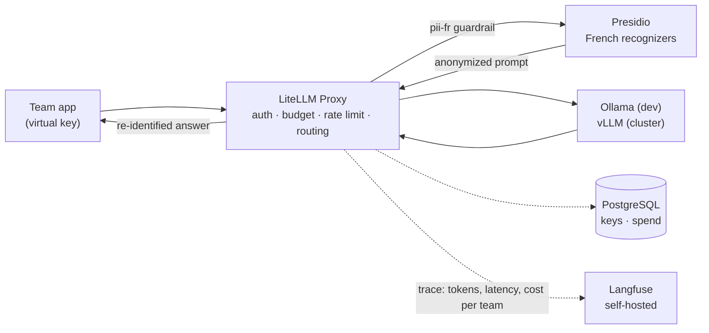

# llmops-gateway

[](https://github.com/Mak5ens/llmops-gateway/actions/workflows/ci.yml)
[](LICENSE)

**One gateway for every LLM call in the company: per-team keys and budgets, French PII anonymized before inference, every call traced and priced.**

> Status: under construction. Milestone 1.1 (local gateway) is done: LiteLLM, PostgreSQL and Ollama run with Docker Compose, behind usage aliases with a fallback, and three client teams have their own key, budget and rate limit. Milestone 1.2 (Presidio anonymization) is in progress: French personal data is masked before the model and put back into the answer, per team; the benchmark on 100 texts is next. See the [roadmap](#roadmap).

## Why

In the (fictional) 200-person company behind this project, every team calls LLMs its own way: shared API keys, no cost tracking, personal data sent in clear text.
The Platform team puts a **single gateway** in front of every model. Product teams become tenants: each one gets its own virtual key, budget and traces.

This repo is block 1 of an [internal AI platform portfolio](#part-of-an-internal-ai-platform). It runs with Docker Compose before any cluster exists, then moves to Kubernetes in [`llmops-platform`](https://github.com/Mak5ens/llmops-platform).

## How it works



1. A team calls one URL with its **virtual key**. LiteLLM checks the key, the budget and the rate limit, then routes by model and use case (`/chat`, `/embed`, `/ocr`), with fallback between models.
2. The **pii-fr guardrail** (LiteLLM's Presidio guardrail) replaces personal data (names, addresses, IBAN, French tax number, phone numbers) with numbered markers such as `<PERSON_1>`. The model only sees the anonymized prompt.
3. The answer is **re-identified** before it goes back to the caller.
4. Every call is traced in a **self-hosted Langfuse** with latency, tokens and cost per team. No trace leaves the company, and an automated test checks that traces contain no personal data.

## Stack

| Function | Tool |
| -- | -- |
| LLM gateway | [LiteLLM Proxy](https://docs.litellm.ai/docs/simple_proxy) |
| PII anonymization | [Microsoft Presidio](https://microsoft.github.io/presidio/) with French recognizers |
| Tracing and cost | [Langfuse](https://langfuse.com/) self-hosted (PostgreSQL, ClickHouse, Redis, MinIO) |
| Local models | [Ollama](https://ollama.com/) with a small open-source model; vLLM takes over on the cluster |
| Gateway database | PostgreSQL |

## Quick start

Requires Docker with Compose v2, [just](https://just.systems/), and [uv](https://docs.astral.sh/uv/) for the tests.

```bash
just gateway-up       # LiteLLM, PostgreSQL, two Ollama servers, Presidio, then the client teams; creates .env on first run
just test             # unit and integration tests: aliases, teams, limits, fallback, Presidio, PII masking
just gateway-down     # add --volumes to also delete the database and the downloaded models
```

First start on a clean machine: about 2 minutes 10 seconds, including the download of three models (about 2 GB) and the build of the Presidio Analyzer image with its French model (2.8 GB on disk).
The gateway listens on `http://localhost:4000` and speaks the OpenAI API. Call it with a team key from `.env`, such as `TEAM_KEY_F1`:

```python
from openai import OpenAI

client = OpenAI(base_url="http://localhost:4000", api_key="sk-local-dev-team-f1")
client.chat.completions.create(model="chat-small", messages=[{"role": "user", "content": "Hello"}])
client.embeddings.create(model="embed", input="Le locataire a payé son loyer en retard.")
```

Langfuse joins the stack in milestone 1.3. To contribute, install the git hooks (requires [pre-commit](https://pre-commit.com/)) with `just hooks`, and run `just lint`. Run `just` alone to list every recipe.

## Models and routing

Teams call **usage aliases**, never model names. The platform decides which model serves each alias in [`config/litellm.yaml`](config/litellm.yaml), so a model can be swapped without touching any client.

| Alias | Use | Model today | Server | Timeout |
| -- | -- | -- | -- | -- |
| `chat-small` | Short answers, classification, extraction | `qwen2.5:0.5b` | `ollama` | 30 s |
| `chat-large` | Better answers, slower | `qwen2.5:1.5b` | `ollama-large` | 20 s, then fallback to `chat-small` |
| `embed` | Embeddings, multilingual (French included), 768 dimensions | `granite-embedding:278m` | `ollama` | 30 s |

**Fallback.** If `chat-large` fails or times out, the gateway answers with `chat-small`. The response header `x-litellm-model-group` says which alias actually served the call, and the logs show `Falling back to model_group = chat-small`.
Measured with `just test -k fallback` on a laptop CPU:

| Situation | Time to answer through `chat-small` |
| -- | -- |
| Server dies while the gateway holds an open connection to it (worst case) | 21 s: the full `chat-large` timeout, then the fallback |
| Following calls during the outage | about 3 s: the connection fails at once |
| Server back | `chat-large` serves again on the next call |

`chat-large` has no retry (`num_retries: 0`): the fallback is its retry. With one retry, the worst case measured 44 s, since each attempt waits for the full timeout. The other aliases keep one retry.

### Swap or add a model

1. Add the model to `OLLAMA_MODELS` in `.env` (and in `.env.example` for everyone), then run `just gateway-up` to download it.
2. In `config/litellm.yaml`, point an alias to it, or add a new entry to `model_list` with a usage alias as `model_name`, the model as `ollama_chat/<name>` (or `ollama/<name>` for embeddings), the server as `api_base`, and a `timeout`.
3. Run `just gateway-reload`: Compose does not see changes to a mounted file, so LiteLLM must restart to read it.
4. Run `just smoke` (the alias tests), and add the new alias to `tests/integration/test_routing.py` if you created one.

Clients keep calling the same alias throughout.

## Teams, keys and budgets

Every client team has its own virtual key, the aliases it may call, a monthly budget and a rate limit, declared in [`config/tenants.yaml`](config/tenants.yaml).
The master key stays with the platform team: it creates teams and keys, and no application uses it.

| Team | Tenant | Aliases | Budget | Key limits | PII masking |
| -- | -- | -- | -- | -- | -- |
| `f1` | F1 strategy analyst (agent with RAG) | `chat-small`, `chat-large`, `embed` | $10 / 30 days | 60 requests and 100k tokens per minute | Optional |
| `mj` | Game master assistant | `chat-small`, `chat-large` | $5 / 30 days | 30 requests and 50k tokens per minute | Optional |
| `baux` | Lease compliance checker | `chat-large`, `embed` | $5 / 30 days | 20 requests and 50k tokens per minute | Required |

`just gateway-up` applies the file through [`scripts/bootstrap_tenants.py`](scripts/bootstrap_tenants.py), and `just tenants` applies it again after an edit, without restarting anything.
The script is idempotent: it creates what is missing, updates what exists, and never deletes a team.
Key values come from `.env` (`TEAM_KEY_F1`, `TEAM_KEY_MJ`, `TEAM_KEY_BAUX`); on the cluster they will come from a secret manager.

A team that steps out of its limits gets an explicit error, and only that team is blocked:

| Situation | Answer |
| -- | -- |
| Alias not allowed for the team | `401 team_model_access_denied`: *This team can only access models=['chat-small', 'chat-large']. Tried to access embed* |
| More requests or tokens per minute than the key allows | `429`: *Rate limit exceeded [...] Current limit: 2, Remaining: 0. Limit resets at: [time]* |
| Budget spent | `400 budget_exceeded`: *Budget has been exceeded! Team=[team] Current cost: [...], Max budget: [...]* |

`tests/integration/test_tenants.py` checks all three on a throwaway team, checks that `f1` still answers meanwhile, and checks that re-running the bootstrap left exactly one key per team.
The budget blocks the call right after the one that crossed it: LiteLLM counts spend in memory at once, and writes it to PostgreSQL in batches, so `/team/info` may show it a few seconds later.

**Why local models have a price.** LiteLLM knows no price for Ollama models, so spend stayed at $0 and budgets never triggered. Each alias carries an internal price per token instead (`chat-small` $0.10 / $0.40 per million tokens in / out, `chat-large` five times more, `embed` $0.02), a chargeback rate that works the same once a paid API joins. See [ADR-014](docs/adr/014-internal-price-for-self-hosted-models.md).

## Personal data anonymization (Presidio)

The gateway masks French personal data before the model sees it, and puts it back into the answer. On a `baux` request, as sent to Ollama (LiteLLM debug log):

| Step | Text |
| -- | -- |
| Caller sends | *Le bailleur est Jean Martin, domicilié au 12 rue de la Paix, 75002 Paris.* then *La locataire est Marie Dupont, IBAN FR76 3000 6000 0112 3456 7890 189. Jean Martin est-il joignable ?* |
| Model receives | *Le bailleur est `<PERSON_1>`, domicilié au `<FR_ADDRESS_2>`.* then *La locataire est `<PERSON_3>`, `<IBAN_CODE_4>`. `<PERSON_1>` est-il joignable ?* |
| Caller gets | The model's answer, with every marker replaced by its value |

### The pii-fr guardrail

The guardrail is LiteLLM's [Presidio integration](https://docs.litellm.ai/docs/proxy/guardrails/pii_masking_v2), set up in [`config/litellm.yaml`](config/litellm.yaml): French analysis, the entities to mask (names, places, addresses, emails, phones, IBAN, cards, crypto wallets, IP addresses, NIR, tax numbers) and a score threshold of 0.4. Dates stay in clear: a lease cannot be checked without them, and they identify nobody on their own.

**Two fixes to LiteLLM's markers.** LiteLLM 1.83.14 numbers markers in a way that breaks on real French text, as tested on this stack: overlapping detections (an address and the city inside it) were spliced into `FR_ADDRESS_2ON_4`, and two people in two messages both became `<PERSON_1>`, so the answer named the tenant as the landlord. Both bugs are open upstream ([#42130](https://github.com/BerriAI/litellm/issues/42130), [#31959](https://github.com/BerriAI/litellm/issues/31959)). [`guardrails/presidio_markers.py`](guardrails/presidio_markers.py) subclasses LiteLLM's guardrail and overrides only the method that builds the markers: overlapping detections are merged into one, and numbers run across the request. See [ADR-015](docs/adr/015-presidio-marker-fixes.md).

**Per team.** Assigning a guardrail to a team is a LiteLLM Enterprise feature, so the gateway uses what the open-source version offers: `pii-fr` runs on every request (`default_on`), and a team set to `pii_masking: optional` in `config/tenants.yaml` is opted out through its metadata, which only the admin API writes. A required team cannot opt out from the request: metadata sent by the caller is ignored.

An opted-out team masks one request by asking for `pii-fr-on-request`, a twin of `pii-fr` that runs only on demand (LiteLLM ignores a request for `pii-fr` itself once the team has opted out of it):

```python
client = OpenAI(base_url="http://localhost:4000", api_key="sk-local-dev-team-f1")
client.chat.completions.create(
    model="chat-small",
    messages=[{"role": "user", "content": "Je suis Marie Dupont, IBAN FR76 3000 6000 0112 3456 7890 189."}],
    # Not part of the OpenAI API, so the SDK sends it through extra_body; with curl, put it at the top of the JSON.
    extra_body={"guardrails": ["pii-fr-on-request"]},
)
```

The choice holds for that call only. A team that always wants masking switches to `pii_masking: required` and runs `just tenants`.

| Behaviour | Measured |
| -- | -- |
| Added latency with the guardrail (mock answer, no model call, p50 over 200 calls) | 11.5 ms instead of 4.5 ms: about 7 ms per request |
| Opted-out team | 4.5 ms, same as a gateway without any guardrail (4.4 ms): Presidio is not called |
| Presidio Analyzer down | Required team: `500 Presidio PII analysis failed` in 28 ms, nothing reaches the model. Opted-out teams keep working |
| Streaming | Works, but the answer is buffered: markers can be split across chunks, so LiteLLM waits for the whole answer, puts the values back, and sends it as one chunk |

**The model must copy markers as they are.** `qwen2.5:1.5b` sometimes drops the angle brackets (`PERSON_1`), and a marker that does not match exactly stays in the answer. A system message such as *Recopie les marqueurs entre chevrons tels quels* was enough in our tests; the benchmark of LAB-116 measures how often it happens.

### Presidio services

[Presidio](https://microsoft.github.io/presidio/) runs as two services. The **Analyzer** finds personal data in a text and returns its type, position and score; the **Anonymizer** replaces those spans with placeholders.
Both can be called directly on `127.0.0.1`:

```bash
curl -s localhost:5002/analyze -H 'content-type: application/json' \
  -d '{"text": "Je suis Marie Dupont et j'"'"'habite à Lyon.", "language": "fr"}'
# PERSON "Marie Dupont" and LOCATION "Lyon", score 0.85 each
```

The official Analyzer image only ships an English spaCy model, which misses French names and places. [`docker/presidio-analyzer/Dockerfile`](docker/presidio-analyzer/Dockerfile) adds `fr_core_news_lg` 3.8.0, pinned by version and SHA-256.
The configuration is mounted from [`config/presidio/`](config/presidio/), so changing it needs `docker compose restart presidio-analyzer`, not a rebuild:

| File | Sets |
| -- | -- |
| `nlp.yaml` | One spaCy model per language (`fr`, `en`) and how their labels map to Presidio entities |
| `recognizers.yaml` | Which recognizers run, in which language, with which context words (table below) |
| `analyzer.yaml` | Supported languages and the default score threshold |

### French recognizers

Presidio knows no French identifier, and its phone recognizer does not look for French numbers.
The recognizers below live in [`docker/presidio-analyzer/pii_recognizers/`](docker/presidio-analyzer/pii_recognizers/) and are baked into the image; a server entry point imports them before Presidio reads `recognizers.yaml`.
A pattern alone is not enough when a check digit exists: a match whose key is wrong is dropped, so ordinary numbers do not come out as identifiers.

| Entity | Recognizer | Detection | False positives kept out by |
| -- | -- | -- | -- |
| `FR_NIR` | `FrNirRecognizer` | Social security number, with or without spaces, Corsica (2A, 2B) and overseas included | Structure (sex, month) and the key: 97 - (13 digits mod 97) |
| `FR_FISCAL_NUMBER` | `FrFiscalNumberRecognizer` | 13-digit tax number (SPI) | First digit 0 to 3, last 3 digits = first 10 mod 511 |
| `FR_ADDRESS` | `FrAddressRecognizer` | Number, street type (rue, avenue, bd...), capitalized name, then optional postcode and city | No checksum exists: street type and capital letters; score 0.6, raised by context |
| `PHONE_NUMBER` | `FrPhoneRecognizer` | Mobile and landline, spaces, dots or dashes, `+33`, `0033`, `(0)` | Validation by the [phonenumbers](https://github.com/daviddrysdale/python-phonenumbers) library, region FR |
| `IBAN_CODE` | Presidio's `IbanRecognizer` | IBANs of every country, French context words added | Check digits (mod 97) |
| `URL` | `UrlOutsideEmailRecognizer` | Presidio's URL recognizer | No longer reports the domain of an email address |

Context words raise a score when they appear in the 5 words before a match: in a lease, *domiciliée 12 rue de la Paix, 75002 Paris* scores 0.95 instead of 0.6, and *joignable au 06 12 34 56 78* 0.75 instead of 0.4.
The spaCy model still makes mistakes of its own, which LAB-116 measures: it sometimes labels an email or `FR76` as a place, and French dates (*12 mars 1985*) are not detected.

Memory of the Analyzer, measured with `docker stats` after 30 requests:

| Models loaded | RAM |
| -- | -- |
| `en_core_web_lg` (official image) | 740 MiB |
| `fr_core_news_lg` | 1.0 GiB |
| `fr_core_news_lg` + `en_core_web_lg` (this stack) | 1.6 GiB |

English costs 570 MiB more; it stays so that prompts in English, such as F1 data, are still analyzed. The container is limited to 2 GiB.
It starts in about 6 seconds once the image is built, and analyzes a 30-word French sentence in about 6 ms on a laptop CPU.

## Tests

Every promise of the gateway is an integration test in [`tests/integration/`](tests/integration/): pytest calls the real stack with the OpenAI SDK and a team key, as a client team would.

| File | Checks |
| -- | -- |
| `test_routing.py` | Each alias answers, served by its own model (header `x-litellm-model-group`); `embed` returns 768 dimensions |
| `test_tenants.py` | Allowed and refused aliases per team (401), rate limit (429), budget (400), isolation from other teams, idempotent bootstrap |
| `test_pii_guardrail.py` | The prompt reaches the model with markers only, the answer (streamed or not) comes back with the real values, two people in two messages get two markers, `f1` is not masked unless it asks, `baux` cannot opt out from the request |
| `test_presidio.py` | The Analyzer finds every French identifier in a lease, context words raise the scores, no identifier comes out of ordinary numbers (amounts, dates, lap numbers), English still works; the Anonymizer replaces what was found |
| `test_fallback.py` | With `ollama-large` stopped, `chat-large` is served by `chat-small` within 30 s and the logs show the fallback |

[`tests/unit/`](tests/unit/) runs without the stack (`just test-unit`, 86 cases in about 2 s): each recognizer, as configured in `recognizers.yaml`, on at least 10 valid cases and on known false positives and edge cases, and the marker fixes of `presidio_markers.py` against the pinned LiteLLM version. The valid NIRs, tax numbers and IBANs were checked with [python-stdnum](https://arthurdejong.org/python-stdnum/).

`just test` runs both suites, starts the stack if it is not running, and passes its arguments to pytest: `just test -k budget`, `just test tests/integration/test_fallback.py`.
The fallback test stops a container, so it always runs last, and restarts it afterwards even on failure.

CI runs the unit tests in a job of their own, and the whole suite on every PR on a clean runner, with the same models as in development: 3 min 22 s for the job, of which 2 min 21 s to start the stack, download the models and build the Presidio Analyzer image. A tiny model in CI was not worth it: it would need a CI-only LiteLLM configuration, and the tests would no longer check the real one.
Removing the fallback from `config/litellm.yaml` makes `test_fallback.py` fail with a `500 APIConnectionError`, so a broken routing configuration cannot be merged.

## Roadmap

- [x] **1.1 Local gateway**: LiteLLM + Ollama + PostgreSQL in Docker Compose, at least two models, per-team virtual keys, budgets and rate limiting.
- [ ] **1.2 Presidio anonymization** (French recognizers and the pii-fr guardrail with re-identification done; benchmark next): pre-call hook, French recognizers, re-identification. Benchmark of added latency and detection rate on 100 texts.
- [ ] **1.3 Tracing and cost with Langfuse**: self-hosted Langfuse, cost per team, automated test proving traces hold no personal data.
- [ ] **1.4 ADR, README and article 1**: why LiteLLM rather than a home-made or cloud gateway; demo GIF.

Definition of done: a text with a name, an IBAN and an address goes in, the model only receives the anonymized version, and the answer comes back re-identified.

## Architecture decisions

Repo-specific ADRs live in [`docs/adr/`](docs/adr/). Cross-cutting decisions (cloud, CI, Langfuse self-hosted, multi-repo layout) live in [`llmops-platform/docs/adr/`](https://github.com/Mak5ens/llmops-platform/tree/main/docs/adr).

## Part of an internal AI platform

| Repo | Role |
| -- | -- |
| **llmops-gateway** (this repo) | Block 1: single entry point to LLMs, keys, budgets, anonymization, tracing |
| [llmops-platform](https://github.com/Mak5ens/llmops-platform) | Block 2: Kubernetes in GitOps, vLLM autoscaling, GPU observability, costs |
| [f1-strategy-analyst](https://github.com/Mak5ens/f1-strategy-analyst) | Block 3: first tenant, an agent with RAG and an evaluation CI |

Write-up: article 1, *Anonymiser avant d'inférer : une gateway LLM conforme au RGPD*, coming on [maxence-labbe.fr](https://maxence-labbe.fr).

## License

[MIT](LICENSE). Synthetic or public data only; no employer code or data.
